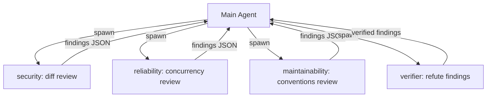

# pi-subagents

A [pi](https://github.com/earendil-works/pi) extension that delegates tasks to
focused, in-process subagents. Each subagent runs as a nested session with its
own system prompt, tools, and context window — allowing long investigations or
parallel reviews to complete without consuming main-conversation tokens.

An interactive list beneath the prompt displays active subagents, their model,
reasoning effort, and context usage. Arrow keys navigate the list, `enter` opens
a full-screen view to inspect or steer a subagent, and typing `@name` routes
messages directly to a subagent without spending a turn on the main model.

```txt
… inspector Analyze dependencies       claude-3-5-haiku 12%
… finder    Find tool definitions      claude-3-7-sonnet (high) 31%
✓ counter   Count lines in src/test    gemini-2.5-flash 18%
```

## How It Works

Subagents are real pi `AgentSession` instances created inside the host process:

- **Isolated context:** Each subagent operates within its own context window.
  Only the final answer or concise completion status is delivered back to the
  main conversation.
- **In-process & detached:** Runs execute asynchronously in the background. The
  main model receives an ID immediately upon spawning and continues working
  while subagents run concurrently.
- **Persistent transcripts:** Each subagent writes its own transcript file
  nested under the parent session. Resuming a subagent continues its existing
  conversation history.
- **Recursion guard:** Subagent sessions are instantiated without extension
  tools, preventing nested subagents from spawning further children.

For domain terms and architectural records, see [CONTEXT.md](CONTEXT.md),
`docs/specifications/`, and `docs/adr/`.

## Requirements

- Node.js 22.19 or newer
- [pi](https://github.com/earendil-works/pi) installed and authenticated

## Installation

Install `pi-subagents` globally across all projects or locally to a checkout:

```bash
pi install git:github.com/Integralist/pi-subagents      # all projects
pi install git:github.com/Integralist/pi-subagents -l   # this project only
pi install .                                            # from a local clone
```

| Command                      | Description                                     |
| ---------------------------- | ----------------------------------------------- |
| `pi list`                    | Display installed extensions and packages       |
| `pi update <source>`         | Pull latest extension updates                   |
| `pi remove <source>`         | Uninstall extension                             |
| `pi install <source>@v0.1.0` | Pin a specific tag, branch, or commit           |

### Quickstart

To try the extension in a standalone session without altering settings:

```bash
make install   # npm install
make try       # launches pi with this extension loaded
```

Ask the model to delegate a task: _"Use a subagent to search for tool definitions
in src/"_.

## Interacting with Subagents

### Subagent List

The list displays beneath the editor while subagents are active. Completed rows
linger for 10 seconds before clearing.

| Key      | Action                                            |
| -------- | ------------------------------------------------- |
| `↓`      | Focus list and move down                          |
| `↑`      | Move up (or return to prompt from top row)        |
| `←` `→`  | Move across columns                               |
| `enter`  | Open full-screen conversation view                |
| `delete` | Stop selected subagent                            |
| `escape` | Exit list focus                                   |

Navigation keys only intercept when the prompt is empty.

### Full-Screen Conversation Viewer

Pressing `enter` on a subagent opens its conversation transcript in full view:

| Key                   | Action                                               |
| --------------------- | ---------------------------------------------------- |
| `↑` `↓` `pgup` `pgdn` | Scroll transcript history                            |
| `home` `end`          | Jump to beginning / end of transcript                |
| text input            | Type in composer prompt; `enter` sends steer message |
| `ctrl+x`              | Stop subagent execution                              |
| `escape`              | Clear composer input, or close viewer                |

### Direct Mentions (`@handle`)

Subagents receive a unique handle based on their name (e.g. `@explore`,
`@explore-2`). Type `@handle <message>` at the main prompt to route input
directly:

| Input                         | Action                                         |
| ----------------------------- | ---------------------------------------------- |
| `@explore inspect auth path`  | Steers or resumes `@explore`                   |
| `@explore`                    | Regular text (handle alone is not routed)      |
| `ask @explore about auth`     | Regular text (only leading mentions route)     |
| `@main @explore text`         | Routes to main model (`@main` stripped)        |
| `@unknown hello`              | Regular text (unrecognized handle)             |

Steering a running subagent injects the message before its next turn. Messaging
a completed subagent resumes its session with full conversation history.

## Defining Subagents

Subagents can be defined dynamically at spawn time or saved as reusable Markdown
files.

### Dynamic Spawn-Time Personas

Callers and skills can describe a subagent directly in `spawn_subagent`:

```txt
spawn_subagent(
  name: "security",
  system_prompt: "You are a Security and Abuse reviewer...",
  tools: ["read", "grep", "find", "ls"],
  prompt: "Review the diff at $TMPDIR/review.diff...",
  description: "Security and abuse review",
)
```

- **Dynamic descriptions:** Skills provide character and tool boundaries
  programmatically without creating files on disk.
- **System prompt precedence:** A supplied `system_prompt` always governs the
  subagent's behavior.

### Reusable Agent Files

Agent files are Markdown documents with YAML frontmatter:

```markdown
---
name: explore
description: Reads codebase files and reports findings
tools: [read, grep, find, ls, bash]
color: cyan
thinking: high
maxTurns: 20
# model: haiku
---

You are a read-only codebase explorer. Answer the prompt with specific file
references (`path/to/file.ts:42`) and outline unexamined areas.
```

| Field         | Required | Description                                                  |
| ------------- | -------- | ------------------------------------------------------------ |
| `name`        | yes      | Identifier used for delegation and `@handle` routing         |
| `description` | yes      | Summary displayed in tool descriptions and UI list           |
| `tools`       | no       | Allowlist of pi tool names (omitted defaults to all tools)   |
| `model`       | no       | Model query (e.g. `haiku`). Omitted inherits parent session  |
| `thinking`    | no       | Reasoning effort (`off`, `low`, `medium`, `high`, etc.)     |
| `color`       | no       | Terminal color for list row (omitted selects next in palette)|
| `maxTurns`    | no       | Maximum turns before wrap-up warning (default: 30)           |

### Discovery Tiers

Pi discovers agent files across two tiers (project overrides user on collision):

1. `~/.pi/agent/agents/*.md` — User agents available across all checkouts
2. `<project>/.pi/agents/*.md` — Project-specific agents

### Example Agents

Nine template definitions live in `examples/`:
- General workflow: `explore.md`, `reviewer.md`, `scribe.md`
- Dimension-split code review: `behaviour.md`, `security.md`, `reliability.md`,
  `maintainability.md`, `plan-adherence.md`, `verifier.md`

To copy examples into the active project:

```bash
make agents   # copies examples/*.md into .pi/agents/
```

## Tool Reference

Five tools manage subagents:

| Tool                  | Parameters                                     | Description                                      |
| --------------------- | ---------------------------------------------- | ------------------------------------------------ |
| `spawn_subagent`      | `prompt`, `description`, route options         | Launch a subagent in the background              |
| `get_subagent_result` | `id`                                           | Retrieve outcome, waiting if currently active    |
| `list_subagents`      | none                                           | Summary of all session subagents and statuses    |
| `steer_subagent`      | `id`, `message`                                | Send mid-run steering message                    |
| `stop_subagent`       | `id`                                           | Terminate subagent run                           |

`spawn_subagent` routes via `system_prompt` (with optional `name` and `tools`) or
`subagent_type` (referencing an agent file). `model`, `thinking`, and
`max_turns` can be overridden on any spawn call.

## Workflow: Dimension-Split Code Review

A code review skill can decompose analysis across parallel dimensions:



1. **Parallel review:** The main agent writes the diff once to a temporary file
   and spawns dimension subagents with restricted tools (`[read, grep, find, ls]`).
2. **Concurrent execution:** Subagents run concurrently up to the configured
   limit without queueing.
3. **Status polling:** `list_subagents` inspects overall progress across all
   dimensions in a single call.
4. **Adversarial verification:** Verification subagents (`verifier`) challenge
   tentative findings to eliminate false positives before final presentation.

## Configuration

Configure concurrency limits in `~/.pi/agent/settings.json` or project
`.pi/settings.json`:

```json
{
  "subagents": {
    "limit": 5
  }
}
```

## Development & Testing

Run verification checks before submitting changes:

```bash
make verify
```

| Target            | Check                                            |
| ----------------- | ------------------------------------------------ |
| `make test`       | Unit and integration suite under `vitest`         |
| `make typecheck`  | TypeScript type checking (`tsc --noEmit`)        |
| `make lint`       | Lint and formatting check with Biome             |
| `make load-check` | Extension resolution via Pi's jiti loader        |

## Licence

MIT
