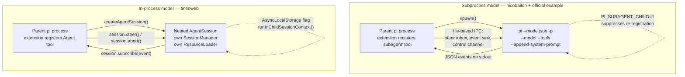

# Pi Extensions and Subagent Implementations

Research date: 2026-08-22. Pi runtime studied:
`@earendil-works/pi-coding-agent` **0.84.2**, installed at
`~/.local/share/fnm/node-versions/v24.6.0/installation/lib/node_modules/@earendil-works/pi-coding-agent`
(resolved via `readlink -f $(which pi)`).

Packages studied:

| Package | Version | Path |
|---------|---------|------|
| `pi-subagents` (Nico Bailon) | 0.54.0 | `../pi-packages/nicobailon-pi-subagents` |
| `@tintinweb/pi-subagents` | 0.18.0 | `../pi-packages/tintinweb-pi-subagents` |

## Overview

A Pi extension is a TypeScript module that default-exports a factory
receiving an `ExtensionAPI` object. The factory registers tools,
slash commands, keyboard shortcuts, CLI flags, renderers, and event
handlers against the running agent session. Extensions run in-process
with full system permissions
(`pi-coding-agent/docs/extensions.md`).

Neither subagent package is a plugin of some dedicated "subagent
framework" — Pi has no first-class subagent primitive. Both packages
build delegation on top of the ordinary extension surface, and they
pick **opposite** strategies for where a child agent actually runs:

- **nicobailon/pi-subagents** spawns a fresh `pi` **subprocess** per
  child (`--mode json -p`) and parses its JSON event stream.
- **tintinweb/pi-subagents** creates a nested **in-process**
  `AgentSession` via the Pi SDK's `createAgentSession()`.

That single choice explains nearly every downstream difference
between them: isolation, cost, steering mechanics, resilience, and
the size of the codebase.

There is also an **official reference implementation** shipped inside
the Pi package itself at
`pi-coding-agent/examples/extensions/subagent/` (README + `index.ts`
+ `agents.ts`). It uses the subprocess approach and is the shortest
path to understanding the pattern before reading either third-party
package.

## Key Concepts

### Extension factory

```typescript
import type { ExtensionAPI } from "@earendil-works/pi-coding-agent";

export default function (pi: ExtensionAPI) {
  pi.on("session_start", async (_event, ctx) => {
    ctx.ui.notify("Extension loaded!", "info");
  });
  pi.registerTool({ /* tool definition */ });
  pi.registerCommand("name", { /* handler */ });
}
```

Factories may be `async` for one-time startup work; async
initialisation completes before `session_start` fires and before
provider registrations are applied
(`docs/extensions.md`, "Async factory functions").

### Load locations

| Location | Scope |
|----------|-------|
| `~/.pi/agent/extensions/*.ts` | Global |
| `~/.pi/agent/extensions/*/index.ts` | Global (subdirectory) |
| `.pi/extensions/*.ts` | Project-local (post-trust) |
| `.pi/extensions/*/index.ts` | Project-local (post-trust) |
| `settings.json` `extensions: [...]` | Explicit paths |
| `pi -e ./src/index.ts` | Ad-hoc, for development |

Project-local extensions load only after project trust is granted
(`docs/extensions.md`, "Extension Locations"; `docs/packages.md`).

### Package manifest

Distribution is via the `pi` key in `package.json`. Both studied
packages use it:

```json
{
  "pi": {
    "extensions": ["./index.ts"],
    "skills": ["./skills"],
    "prompts": ["./prompts"]
  }
}
```

(`nicobailon-pi-subagents/package.json`;
`tintinweb-pi-subagents/package.json` declares only `extensions`,
plus `video`/`image` preview media.)

Supported fields: `extensions`, `skills`, `prompts`, `themes`,
`video`, `image`. Paths accept globs and `!exclusions`. Without a
manifest, convention directories `extensions/`, `skills/`,
`prompts/`, `themes/` are auto-discovered (`docs/packages.md`).

Install sources and disk locations (`docs/packages.md`):

```bash
pi install npm:@tintinweb/pi-subagents
pi install npm:pi-subagents
pi install git:github.com/user/repo@v1
pi install ./relative/path
```

- npm global: `~/.pi/agent/npm/`; npm project: `.pi/npm/`
- git global: `~/.pi/agent/git/<host>/<path>`
- `-l` installs at project level into `.pi/settings.json`

### Peer dependency model

Both packages declare the Pi runtime as **peer** dependencies, never
as regular ones — the extension loads inside the host `pi` process
and must bind to the host's copy:

```json
"peerDependencies": {
  "@earendil-works/pi-agent-core": "*",
  "@earendil-works/pi-ai": ">=0.80.0",
  "@earendil-works/pi-coding-agent": "*",
  "@earendil-works/pi-tui": "*"
}
```

(`nicobailon-pi-subagents/package.json`. tintinweb pins
`>=0.81.0` on the three public packages.)

Runtime deps that *are* bundled must live in `dependencies`, not
`devDependencies` — package installation uses production installs
(`docs/extensions.md`, "Extension Packaging").

Both ship **TypeScript source directly**; Pi transpiles on load.
tintinweb has a `build` script producing `dist/`, but its `pi`
manifest still points at `./src/index.ts`.

## Architecture / How It Works

### Pi's event lifecycle

Pi fires events in this order (`docs/extensions.md`, "Lifecycle
Overview"):

1. **Startup:** `project_trust` → `session_start` →
   `resources_discover`
2. **User input:** `input` (extension commands checked first) →
   skill/template expansion → `before_agent_start` → `agent_start`
3. **LLM turn:** `message_start`/`update`/`end` → `turn_start` →
   `context` → `before_provider_headers`/`request` →
   `after_provider_response` → tool execution → `turn_end`
4. **Session events:** `session_before_switch` → `session_shutdown`
   → (new session) `session_start`
5. **Cleanup:** `session_shutdown` on exit

### The two subagent architectures



### Subprocess model (nicobailon, official example)

The official example builds the child command line as
(`examples/extensions/subagent/index.ts:300-341`):

```typescript
const args: string[] = ["--mode", "json", "-p", "--no-session"];
if (model) args.push("--model", model);
args.push("--thinking", dispatchDefaults.thinkingLevel);
if (agent.tools?.length) args.push("--tools", agent.tools.join(","));
args.push("--append-system-prompt", tmpPromptPath);
args.push(`Task: ${task}`);
const proc = spawn(invocation.command, invocation.args, { /* ... */ });
```

It resolves the executable by preferring `process.argv[1]` re-run
under `process.execPath`, falling back to a standalone `pi` binary
(`index.ts:250-259`).

nicobailon uses the identical base args
(`src/runs/foreground/execution.ts:332` and
`src/runs/background/subagent-runner.ts:1524`, both
`baseArgs: ["--mode", "json", "-p"]`) and extends the argv builder
substantially (`src/runs/shared/pi-args.ts:588-675`):

```
--session <file> | --no-session | --session-dir <dir>
--model <id>
--tools <csv>
--no-extensions | --extension <path> (repeated)
--no-context-files
--no-skills
@<taskFilePath>        # task delivered via file when > 8000 chars
"Task: <task>"          # otherwise inline in argv
```

The `TASK_ARG_LIMIT = 8000` / file-delivery fallback exists because
endpoint-protection software scans argv and can `SIGKILL` children
whose command line embeds long natural-language text
(`pi-args.ts:66-88`, `SUBAGENT_TASK_DELIVERY_ENV`).

**Recursion guard.** The package entry point refuses to register the
parent extension inside a child process
(`nicobailon-pi-subagents/index.ts:1-10`):

```typescript
const registerParentExtension = process.env.PI_SUBAGENT_CHILD === "1"
	? undefined
	: (await import("./src/extension/index.ts")).default;

export default function registerSubagentExtension(pi: ExtensionAPI): void {
	registerParentExtension?.(pi);
}
```

Without this, every child would re-register the `subagent` tool and
could spawn grandchildren unboundedly.

**Parent↔child IPC** is entirely environment-variable-addressed
file channels. `pi-args.ts:106-135` defines ~25 env vars, including:

| Env var | Purpose |
|---------|---------|
| `PI_SUBAGENT_CHILD` | Marks child; suppresses re-registration |
| `PI_SUBAGENT_RUN_ID` | Run identity |
| `PI_SUBAGENT_PARENT_EVENT_SINK` | Child → parent event file |
| `PI_SUBAGENT_PARENT_CONTROL_INBOX` | Parent → child control |
| `PI_SUBAGENT_STEER_INBOX` | Mid-run steering messages |
| `PI_SUBAGENT_STEER_CAPABILITY` / `_ACK_DIR` | Steering auth + ack |
| `PI_SUBAGENT_PARENT_DEPTH` / `_PATH` | Nesting depth and lineage |
| `PI_SUBAGENT_CAPABILITY_CEILING` | Downward-only privilege bound |
| `PI_SUBAGENT_PARENT_CAPABILITY_TOKEN` | Unforgeable parent proof |
| `PI_SUBAGENT_TASK_DELIVERY` | `auto` \| `file` argv workaround |
| `PERMISSION_POLICY` / `PERMISSION_AUDIT_PATH` | Tool permissions |
| `TOOL_BUDGET_ENV` / `RUN_FANOUT_BUDGET_ENV` | Spend caps |
| `STRUCTURED_OUTPUT_SCHEMA` / `_CAPTURE` | JSON-schema results |

The child also gets extra extensions injected —
`src/runs/shared/subagent-prompt-runtime.ts` and
`src/extension/fanout-child.ts` — via repeated `--extension` flags
(`pi-args.ts:92-105, 634`). This is how the child gains its own
control-channel behaviour while the parent tool stays suppressed.

### In-process model (tintinweb)

tintinweb never spawns a process. It builds a child session inside
the parent (`src/agent-runner.ts:709-940`):

```typescript
const loader = new DefaultResourceLoader({
  cwd: configCwd, agentDir, noExtensions, additionalExtensionPaths,
  extensionsOverride, noSkills,
  noPromptTemplates: true, noThemes: true, noContextFiles: true,
  systemPromptOverride: () => systemPrompt,
  appendSystemPromptOverride: () => [],
});
await runInChildSessionContext(() => loader.reload());
// ...
const { session } = await runInChildSessionContext(
  () => createAgentSession(sessionOpts)
);
await session.bindExtensions({ onError: (err) => { /* ... */ } });
```

Session persistence is chosen per-agent (`agent-runner.ts:888-908`):

- `SessionManager.open(resumeSessionFile, dir)` — resuming
- `SessionManager.create(cwd, dir, { parentSession })` — persisted,
  nested under its spawner in `/resume`
- `SessionManager.inMemory(cwd)` — ephemeral (the nested default)

**Recursion guard** is an `AsyncLocalStorage` boolean rather than an
env var (`src/child-context.ts`):

```typescript
const childSessionContext = new AsyncLocalStorage<boolean>();
export function inChildSessionContext(): boolean {
  return childSessionContext.getStore() === true;
}
export function runInChildSessionContext<T>(fn: () => Promise<T>) {
  return childSessionContext.run(true, fn);
}
```

Because it is async-context-local, concurrent top-level extension
work is unaffected — a genuine advantage over a process-global env
flag when many children run at once.

**Model/provider inheritance** is a documented compatibility hack
(`agent-runner.ts:910-927`): Pi 0.80.8 replaced
`createAgentSession`'s `modelRegistry` option with `modelRuntime`,
but `ExtensionContext` still exposes only the registry facade. The
package reaches into the private `runtime` field and passes **both**
so the child keeps the parent's providers across the supported Pi
range.

**Control** uses SDK methods directly — `session.steer(msg)`,
`session.abort()`, `session.subscribe(event)` — for turn counting,
graceful `max_turns` wrap-up, and live UI
(`agent-runner.ts:986-1010`).

## API Surface / Interface

### `ExtensionAPI` (verified against `dist/core/extensions/types.d.ts:867-1032`)

| Method | Purpose |
|--------|---------|
| `on(event, handler)` | 35 lifecycle events (list below) |
| `registerTool(def)` | LLM-callable tool; hot-refreshes, no `/reload` |
| `registerCommand(name, opts)` | Slash command + arg completions |
| `registerShortcut(keyId, opts)` | Keyboard shortcut |
| `registerFlag(name, opts)` / `getFlag(name)` | CLI flags |
| `registerMessageRenderer(type, r)` | Render `sendMessage` output |
| `registerEntryRenderer(type, r)` | Render `appendEntry` output |
| `registerMarkdownTransformer(t)` | Rewrite rendered Markdown |
| `sendMessage(msg, opts?)` | Inject message into LLM context |
| `sendUserMessage(content, opts?)` | Inject as if user-typed |
| `appendEntry(type, data?)` | Persist state, **not** in LLM context |
| `setSessionName` / `getSessionName` | Session display name |
| `setLabel(entryId, label)` | Bookmark entries for `/tree` |
| `exec(cmd, args, opts?)` | Shell exec with signal + timeout |
| `getActiveTools` / `getAllTools` / `setActiveTools` | Tool gating |
| `getCommands()` | Slash-command introspection |
| `setModel(model)` | Returns `false` with no API key |
| `getThinkingLevel` / `setThinkingLevel` | Clamped to model caps |
| `registerProvider` / `unregisterProvider` | Model providers |
| `events` | `EventBus` for inter-extension messaging |

### Events

`project_trust`, `resources_discover`, `session_start`,
`session_info_changed`, `session_before_switch`,
`session_before_fork`, `session_before_compact`, `session_compact`,
`session_shutdown`, `session_before_tree`, `session_tree`,
`context`, `before_provider_request`, `before_provider_headers`,
`after_provider_response`, `before_agent_start`, `agent_start`,
`agent_end`, `agent_settled`, `turn_start`, `turn_end`,
`message_start`, `message_update`, `message_end`,
`tool_execution_start`, `tool_execution_update`,
`tool_execution_end`, `model_select`, `thinking_level_select`,
`tool_call`, `tool_result`, `user_bash`, `input`.

The ones that matter most for subagent work:

- **`input`** — intercept before skill/template expansion. Returns
  `{action: "continue" | "transform" | "handled"}`. tintinweb's
  `@agent` mention routing lives here (`src/index.ts:782`).
- **`tool_call`** — can **block** a tool (`{block: true, reason,
  terminate}`) and mutate `event.input`. This is the permission-gate
  seam.
- **`tool_result`** — can **modify** results; handlers chain.
- **`before_agent_start`** — inject a message and/or rewrite the
  system prompt for the turn.
- **`agent_settled`** — fires when Pi will not continue on its own;
  the natural place to drain background work.

### `ExtensionContext` vs `ExtensionCommandContext`

`ExtensionContext` (all handlers): `ui`, `mode`
(`"tui"|"rpc"|"json"|"print"`), `hasUI`, `cwd`,
`isProjectTrusted()`, `sessionManager`, `modelRegistry`, `model`,
`thinkingLevel`, `scopedModels`, `signal`, `isIdle()`, `abort()`,
`hasPendingMessages()`, `shutdown()`, `getContextUsage()`,
`compact()`, `getSystemPrompt()`.

`ExtensionCommandContext` (command handlers only) adds session
**replacement**: `getSystemPromptOptions()`, `waitForIdle()`,
`newSession()`, `fork(entryId)`, `navigateTree(targetId)`,
`switchSession(path)`, `reload()`
(`docs/extensions.md:1082-1331`).

### Tool definition

```typescript
pi.registerTool({
  name: "my_tool",
  label: "My Tool",
  description: "LLM-visible description",
  promptSnippet: "One-line available-tools entry",
  promptGuidelines: ["Use my_tool when..."],
  parameters: Type.Object({ action: StringEnum(["list","add"]) }),
  prepareArguments(args) { return args; },   // compat shim
  async execute(toolCallId, params, signal, onUpdate, ctx) {
    onUpdate?.({ content: [...], details: { progress: 50 } });
    return { content: [...], details: {...}, usage, terminate };
  },
  renderCall(args, theme, context) { /* TUI */ },
  renderResult(result, options, theme, context) { /* TUI */ },
});
```

Both packages implement `renderCall`/`renderResult` with
`@earendil-works/pi-tui` primitives (`Text`, `Box`) — see
`nicobailon-pi-subagents/src/extension/index.ts:672-697`.

### SDK (`dist/core/sdk.d.ts`)

`createAgentSession(options)` is the in-process spawn primitive
tintinweb depends on. Relevant options:

`cwd`, `agentDir`, `modelRuntime`, `model`, `thinkingLevel`,
`scopedModels`, `noTools` (`"all"|"builtin"`), `tools` (allowlist),
`excludeTools` (denylist, applied after `tools`), `customTools`,
`resourceLoader`, `sessionManager`, `settingsManager`,
`sessionStartEvent`.

Built-in tools: `read`, `bash`, `edit`, `write`, `grep`, `find`,
`ls`. Also exported: `withFileMutationQueue()` — custom tools that
write files should use it so they share the per-file queue with
built-in `edit`/`write`.

## The three implementations compared

### Official example (`pi-coding-agent/examples/extensions/subagent/`)

~36 KB `index.ts` + `agents.ts`. Three tool modes:

| Mode | Parameters | Behaviour |
|------|-----------|-----------|
| Single | `{agent, task}` | One agent, one task |
| Parallel | `{tasks: [...]}` | Max 8 tasks, 4 concurrent |
| Chain | `{chain: [...]}` | Sequential, `{previous}` placeholder |

Agents are Markdown + YAML frontmatter (`name`, `description`,
`tools`, `model`) discovered from `~/.pi/agent/agents/*.md` (always)
and `.pi/agents/*.md` (only under `agentScope: "project"|"both"`,
with an interactive confirmation gate). Frontmatter parsing uses
Pi's exported `parseFrontmatter` and `CONFIG_DIR_NAME`
(`agents.ts:1-10`). Parallel output is capped at 50 KB per task in
the model-visible result.

This is the design both third-party packages started from — the
agent-file format is essentially identical across all three.

### tintinweb/pi-subagents (0.18.0, ~12.5k LOC)

**Positioning:** a faithful Claude Code clone. Same tool names, same
calling conventions, same UI idioms.

Tools registered (`src/nested-tools.ts:50`, `src/index.ts:1453`,
`:2105`, `:2194`): `Agent`, `get_subagent_result`, `steer_subagent`.

`Agent` tool parameters (`src/index.ts:1463-1520`): `prompt`,
`description`, `name`, `subagent_type`, `model`, `thinking`,
`max_turns`, `run_in_background` (**defaults true**), `resume`,
`isolated`, `inherit_context`, `schedule`.

Distinctive features:

- **Background-first.** Spawns detach by default; results arrive as
  a `subagent-notification` custom message delivered
  `{deliverAs: "followUp", triggerTurn: true}`
  (`src/index.ts:421-463`), so the parent model reasons about the
  result on its next turn.
- **`@agent` mentions.** Typing `@explore do X` routes to that agent
  without a main-model turn, via the `input` event
  (`src/index.ts:782-835`). Handles the whole lifecycle: message a
  running agent, resume a finished one, reopen from disk, or start a
  new one. Starting uses an off-screen **clone** of the conversation
  that holds only the `Agent` tool, reproducing Claude Code's
  "model writes the child's prompt" behaviour without a visible turn.
- **FleetView + conversation viewer.** Navigable list below the
  editor; `Enter` opens a live auto-scrolling transcript; steer
  inline; `x x` to stop.
- **Nested subagents.** Opt-in via `allowed_subagents` frontmatter,
  depth-capped (default 2). Children are ownership-scoped, stopped
  when the owner finishes, and their spend rolls up. Not addressable
  by `@` mention — a deliberate privilege boundary.
- **Scheduling.** `schedule` accepts 6-field cron, intervals
  (`"5m"`), relative one-shots (`"+10m"`), or ISO timestamps
  (`croner` dependency). Session-scoped, PID-locked storage at
  `<cwd>/.pi/subagent-schedules/<sessionId>.json`.
- **Graceful turn limits.** At `max_turns` the runner calls
  `session.steer("...wrap up immediately...")`, and only aborts
  after `graceTurns` more (`src/agent-runner.ts:986-1005`) —
  producing clean partial output instead of truncation.
- **Event bus + cross-extension RPC.** Emits `subagents:created`,
  `started`, `completed`, `failed`, `steered`, `compacted`,
  `ready`, `scheduler_ready`. Accepts `subagents:rpc:ping|spawn|stop`
  with versioned reply envelopes (`src/cross-extension-rpc.ts`).
- **Git worktree isolation**, **persistent agent memory** (project /
  local / user scopes), **skill preloading**, **tool denylists**,
  **model-scope enforcement** against `enabledModels`.

Registers exactly one slash command: `/agents` (`src/index.ts:3223`).

### nicobailon/pi-subagents (0.54.0, ~200 source files)

**Positioning:** an orchestration platform. Delegation is the floor,
not the ceiling — the headline feature is scripted multi-agent
workflows.

Registers exactly **one** tool, `subagent`
(`src/extension/index.ts:656`), which multiplexes on parameters
rather than exposing several tools. Top-level params
(`src/extension/schemas.ts:255-330`) include `agent`, `task`,
`action` (management/control mode), `workflowScript`, `async`,
`context` (`fresh`|`fork`|`profile`), `isolation`, `worktree`,
`timeoutMs`, `mission`, plus a large management surface (`schedule.
create`, `watchdog.configure`, `mission.attach-run`, `interrupt`,
`steer`, `status` with `view: fleet|transcript`, …).

Distinctive features:

- **`workflowScript`** — a trusted inline JavaScript statement body
  evaluated in a sandbox exposing `runs.run(key, {agent, task,
  worktree?, gate?})`, `runs.all([...])`, `runs.steer(key, msg)`,
  `runs.status(id)`, `emit(value)`, and for missions `state.get` /
  `state.set`. No filesystem, shell, Pi tools, or host globals.
  Parsed with `acorn` (a declared dependency) to reject nested
  async helpers.
- **Dynamic fanout** — `{expand: {from: {output, path}}, parallel,
  collect}` expands a prior child's structured output (via JSON
  Pointer) into N children, with `maxItems` bounds and
  `onEmpty: skip|fail` (`schemas.ts:154-190`).
- **Structured output** — per-child `outputSchema` (JSON Schema)
  captured through `STRUCTURED_OUTPUT_SCHEMA_ENV` /
  `_CAPTURE_ENV`.
- **Capability ceiling** — a monotonically narrowing privilege bound
  passed down the process tree
  (`src/runs/shared/capability-ceiling.ts`), with intersection
  semantics and an audit trail. Paired with unforgeable parent
  capability tokens for steering authorisation.
- **Budgets** — `toolBudget` (soft/hard), `usageBudget` (tokens,
  costUSD), `maxSubagentSpawnsPerRun` (default 64, separate from
  concurrency), and `RUN_FANOUT_BUDGET_ENV`.
- **Missions** — durable, resumable multi-run state under
  `~/.pi/agent/missions/`, with goal-driven loops
  (`src/missions/goal-driver.ts`), decisions, artifacts, and
  delivery receipts.
- **Watchdog** — a supervisory subsystem (`src/watchdog/`, 16 files)
  that reviews child turn deltas, arbitrates permissions, and pulls
  LSP diagnostics (`watchdog/lsp-diagnostics.ts`).
- **Intercom / control channel** — a native supervisor channel under
  `~/.pi/agent/intercom/` for out-of-band parent↔child messaging.
- **Public extension API** — the only package of the two that
  exports a programmatic surface for *other* extensions, via 13
  `package.json` `exports` entries (`./background-work`,
  `./delegation`, `./agents`, `./capability-ceiling`,
  `./control-channel`, `./external-job-provider`, …), documented in
  `docs/extension-api.md`.
- **Ships six agents** (`scout`, `researcher`, `worker`, `reviewer`,
  `oracle`, `delegate`), six prompt templates (`/council`,
  `/parallel-review`, `/review-loop`, …), and two skills.
- **`/subagents-doctor`** self-diagnostic and `/subagents-guide
  [topic]` in-product docs (topics: overview, workflows, agents,
  missions, observability, tool-reference, configuration, models,
  watchdog, extension-api).

### Side-by-side

| Dimension | nicobailon | tintinweb |
|-----------|-----------|-----------|
| Child runtime | `pi` subprocess, `--mode json -p` | Nested `createAgentSession()` |
| Isolation | OS process | Async context + own `SessionManager` |
| Crash blast radius | Child only | Can take the parent down |
| Startup cost | Full `pi` boot per child | Session construction only |
| Recursion guard | `PI_SUBAGENT_CHILD=1` env | `AsyncLocalStorage` flag |
| IPC | Files + env-var addressing | Direct method calls |
| Steering | Steer inbox file + capability + ack | `session.steer()` |
| Tools exposed | 1 (`subagent`, param-multiplexed) | 3 (`Agent`, `get_subagent_result`, `steer_subagent`) |
| Default execution | Async configurable (`asyncByDefault`) | Background (`run_in_background: true`) |
| Slash commands | `/subagents-fleet`, `/subagents-doctor`, `/subagents-guide`, `/council`, … | `/agents` |
| Orchestration | `workflowScript` + dynamic fanout + missions | Model-driven; nested agents |
| Extension API for others | Yes — 13 export paths | Event bus + RPC only |
| Test tooling | `node --test` + `--experimental-strip-types` | vitest + biome |
| Approx. size | ~200 src files | 39 src files, ~12.5k LOC |

## Gotchas and Edge Cases

**Extension-level**

- Extensions run with full system permissions. There is no sandbox
  (`docs/extensions.md`, security note).
- Session-replacement footgun: after `newSession`/`fork`/
  `switchSession`/`reload`, captured `pi` and `ctx` objects are
  **stale**. Use the fresh context the `withSession` callback hands
  you, and treat `await ctx.reload(); return;` as terminal for the
  handler (`docs/extensions.md:1233-1331`).
- Two extensions may register the same command name; Pi
  disambiguates with numeric suffixes (`/review:1`, `/review:2`).
- `appendEntry` data does **not** enter LLM context; `sendMessage`
  does. Choose deliberately.
- Custom tools that write files must use `withFileMutationQueue()`
  or they race the built-in `edit`/`write`.
- Tool state belongs in the result `details` so it survives session
  branching; reconstruct on `session_start` by iterating
  `ctx.sessionManager.getEntries()`.

**Subprocess-model specifics**

- Long tasks in argv can trip EDR pre-execution scanning and produce
  an unexplained zero-activity `SIGKILL`. nicobailon's answer is the
  8000-char threshold plus a `file` delivery mode and a retry path
  (`pi-args.ts:66-88`).
- The `pi` executable must be located reliably. Both the official
  example and nicobailon prefer re-running `process.argv[1]` under
  `process.execPath` before falling back to a `pi` binary on PATH
  (`pi-spawn.ts:26-110`).
- Without a recursion guard, the child re-registers the parent's
  tool and can fork bomb.

**In-process-model specifics**

- `ExtensionContext` exposes `modelRegistry`, but modern
  `createAgentSession` wants `modelRuntime`. tintinweb reads the
  private `.runtime` field off the facade and passes both — a
  documented compatibility hack that could break on any Pi release
  (`agent-runner.ts:910-927`).
- Pi activates only its four default built-ins at turn 1, and `ext:`
  narrowing has no registry-level expression, so tool scope must be
  re-derived from the loader's live extension maps after
  `bindExtensions()` (`agent-runner.ts:970-980`).
- A bad `tools:` entry in agent frontmatter used to produce a
  silently broken agent — pi accepted the name into the allowlist,
  then dropped it at registration with no signal (tintinweb issue
  #75). The package now validates against `BUILTIN_TOOL_NAMES` and
  surfaces a `tools-error:` activity line
  (`agent-runner.ts:735-747`).
- `AgentSession.dispose()` only calls `ExtensionRunner.invalidate()`
  — Pi emits `session_shutdown` itself in
  `AgentSessionRuntime.dispose()`, which a nested session never goes
  through, so the package emits it manually
  (`agent-manager.ts:208-214`).

**Behavioural**

- tintinweb: `schedule` cannot combine with `inherit_context` (no
  parent conversation exists at fire time) or `resume`, and refuses
  `run_in_background: false` (`src/index.ts:1761-1766`).
- tintinweb: headless `pi -p` does **not** wait for scheduled
  subagents.
- tintinweb: a resumed agent runs under the agent type's *current*
  frontmatter, not the definition in force during its first run.
- Both: agent definitions are re-read per invocation, so you can
  edit an agent mid-session.

## Trade-offs

**Subprocess vs in-process** is the fundamental fork.

Subprocess buys true isolation — a child that OOMs, hangs, or
segfaults cannot take the parent's TUI with it — plus trivially
correct concurrency and an obvious place to hang OS-level controls
(process trees, kill signals, per-child cwd/worktree). It pays in
full `pi` startup latency per child, no shared object graph (every
piece of coordination becomes file IPC and env-var addressing), and
a much larger surface: nicobailon's ~25 env vars and file channels
exist entirely to recover what tintinweb gets from a method call.

In-process buys directness. `session.steer()`, `session.abort()`,
and `session.subscribe()` are immediate, typed, and
synchronously observable, which is why tintinweb's live UI
(FleetView, streaming conversation viewer, inline steering) is both
richer and shorter than the subprocess equivalent. It pays in shared
fate — a child's unhandled rejection is the parent's problem — and
in coupling to unstable SDK internals, as the `modelRuntime` hack
shows.

**One multiplexed tool vs several named tools.** nicobailon's single
`subagent` tool with an `action` discriminator keeps one entry in
the model's tool list but makes the schema very large and pushes
validation into runtime branching. tintinweb's three Claude
Code-named tools cost three tool slots but give the model a
narrower, more familiar schema per call — and the Claude Code naming
means models with prior exposure to that convention need less
in-context instruction.

**Model-driven vs script-driven orchestration.** tintinweb leaves
composition to the parent model: spawn several agents, read
notifications, decide what next. nicobailon adds `workflowScript`,
where control flow is deterministic JavaScript and only the leaves
are model calls. Script-driven is reproducible and cheap to reason
about but requires a sandbox, a parser (`acorn`), and a documented
mini-API the model must learn — the `workflowScript` description
alone is ~1500 characters of prompt budget on every turn.

**Foreground vs background default.** Both default to background,
and both surface the same reasoning in their tool descriptions: pass
`run_in_background: false` only when the very next action depends on
the result. tintinweb's guideline text is explicit that "wanting the
result next is not enough on its own"
(`src/index.ts:1378`).

**Prompt budget.** Every schema field description, `promptSnippet`,
and `promptGuidelines` entry is spent on each turn. nicobailon's
`subagent` schema is measurably expensive; tintinweb mitigates by
removing `schedule` from the tool spec entirely when the feature is
disabled, rather than leaving a documented-but-unusable field.

## Notes for building your own

Things worth deciding early, in rough dependency order:

1. **Child runtime** — subprocess or in-process. Everything else
   follows. Start from `examples/extensions/subagent/index.ts` for
   subprocess or `tintinweb/src/agent-runner.ts:880-940` for
   in-process.
2. **Recursion guard** — env var (subprocess) or
   `AsyncLocalStorage` (in-process). Non-negotiable.
3. **Tool shape** — one multiplexed tool or several named ones, and
   whether to adopt Claude Code's names for free model familiarity.
4. **Result delivery** — blocking tool return, or
   `pi.sendMessage(..., {deliverAs: "followUp", triggerTurn: true})`
   for background completion.
5. **Agent definition format** — all three implementations converge
   on Markdown + YAML frontmatter via Pi's exported
   `parseFrontmatter`; there is no reason to invent another.
6. **State** — `appendEntry` for session-scoped state that must not
   reach the LLM; a file under `.pi/` for anything cross-session.

## References

**Pi runtime (local install, v0.84.2)**

- `dist/core/extensions/types.d.ts:867-1032` — `ExtensionAPI`
- `dist/core/sdk.d.ts` — `createAgentSession` options
- `dist/core/agent-session.d.ts`, `dist/core/session-manager.d.ts`
- `docs/extensions.md` (121 KB, 60+ sections) — the authoritative
  reference; the web page at
  <https://pi.dev/docs/latest/extensions> is the same content
- `docs/sdk.md`, `docs/packages.md`, `docs/tui.md`, `docs/skills.md`
- `examples/extensions/subagent/` — official reference
  implementation (README, `index.ts`, `agents.ts`, `agents/`,
  `prompts/`)
- `examples/extensions/README.md` — index of ~80 example extensions

**nicobailon/pi-subagents 0.54.0**

- `index.ts:1-10` — recursion guard
- `src/extension/index.ts:656-700` — tool registration
- `src/extension/schemas.ts:133-355` — parameter schemas
- `src/runs/shared/pi-args.ts` — argv/env construction
- `src/runs/shared/pi-spawn.ts` — executable resolution
- `src/runs/foreground/execution.ts:332`,
  `src/runs/background/subagent-runner.ts:1524` — `baseArgs`
- `src/runs/shared/capability-ceiling.ts` — privilege bounds
- `docs/` — agents, configuration, extension-api, missions, models,
  observability, tool-reference, watchdog, workflows
- <https://github.com/nicobailon/pi-subagents>

**tintinweb/pi-subagents 0.18.0**

- `src/index.ts:1453-1520` — `Agent` tool definition
- `src/index.ts:782-835` — `@agent` mention routing via `input`
- `src/index.ts:421-463` — background completion notification
- `src/agent-runner.ts:709-1010` — child session construction
- `src/child-context.ts` — `AsyncLocalStorage` recursion guard
- `src/nested-tools.ts:50` — nested tool names
- `src/cross-extension-rpc.ts` — RPC envelopes
- `README.md` — the most detailed feature narrative of the two
- <https://github.com/tintinweb/pi-subagents>
